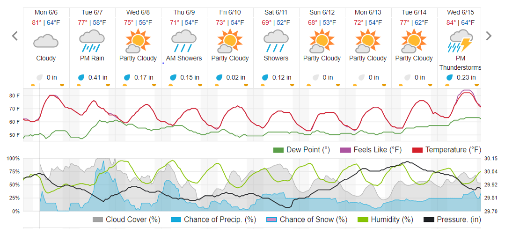
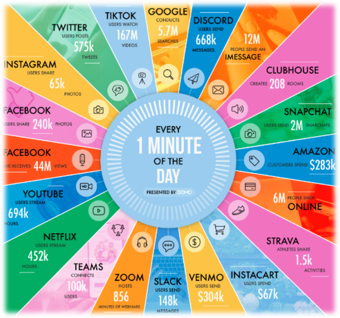
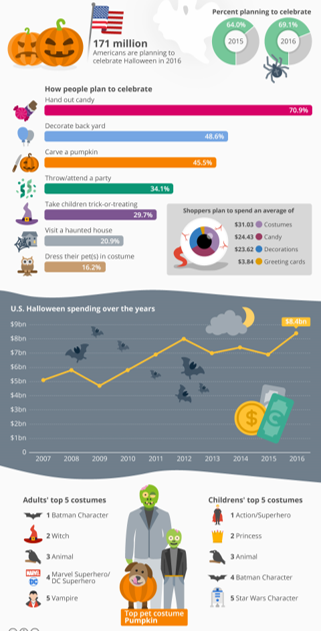
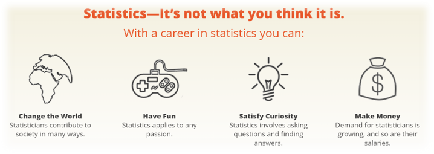

```{r setup, include=FALSE, echo=FALSE}
options(htmltools.dir.version = FALSE)
knitr::opts_chunk$set(
  fig.retina=2,
  #out.width = "75%",
  #out.height = "50%",
  htmltools.preserve.raw = FALSE,      # needed for windows
  scipen=100,                          # suppresses scientific notation
  getSymbols.warning4.0 = FALSE,       # suppresses getSymbols warnings
  cache = FALSE,
  echo = TRUE,
  hiline = TRUE,
  message = FALSE, 
  warning = FALSE
)

options(scipen = 100)


# install helper package (pacman)
# pacman loads and installs other packages, if needed
if (!require("pacman")) install.packages("pacman", repos = "http://lib.stat.cmu.edu/R/CRAN/")

# install and load required packages
# pacman should be first package in parentheses and then list others
pacman::p_load(pacman, tidyverse, gridExtra, magrittr, tidyquant, dygraphs, knitr, maps, usdata, mapproj, shadowtext, ggthemes)

# verify packages (comment out in finished documents)
p_loaded()


```

```{r xaringan-themer, include=FALSE, warning=FALSE}

library(xaringanthemer)

palette <- c(
  SU_Orange1        = "#F76900",
  SU_Orange2        = "#FF8E00",
  SU_Red_Orange     = "#FF431B",
  SU_Blue1          = "#000E54",
  SU_Blue2          = "#203299",
  SU_Light_Blue     = "#2B72D7",
  SU_White          = "#FFFFFF",
  SU_Light_Gray     = "#ADB3B8",
  SU_Medium_Gray    = "#707780",
  SU_Black          = "#000000", 
  
  steel_blue        = "#4682B4",
  corn_flower_blue  = "#6495ED",
  deep_sky_blue     = "#00BFFF",
  dark_magenta      = "#8B008B",
  medium_orchid     = "#BA55D3",
  lime_green        = "#32CD32",
  light_sea_green   = "#20B2AA",
  chartreuse        = "#7FFF00",
  orange_red        = "#FF4500",
  blue              = "#0000FF",
  green             = "#008000"
  
)


style_duo(
  
  title_slide_text_color = "#F76900",       # SU_Orange1
  title_slide_background_color = "#000E54", # SU_Blue1
  primary_color = "#203299",                # SU_Blue2
  secondary_color = "#FF8E00",              # SU_Orange2
  inverse_header_color = "#FFFFFF",         # SU_White
  link_color = "#F76900",                   # SU_Orange1
  code_inline_color = "#FF431B",            # SU_Red_Orange
  text_bold_color = "#F76900",              # SU_Orange1

  header_font_google = google_font("Open Sans"),
  text_font_google = google_font("Open Sans"),
  code_font_google = google_font("Source Code Pro"),
  colors = palette
)

```


```{r xaringan-panelset, echo=FALSE}

xaringanExtra::use_panelset()

```


```{r xaringan-tile-view, echo=FALSE}
xaringanExtra::use_tile_view()

```

```{r xaringan-fit-screen, echo=FALSE}
xaringanExtra::use_fit_screen()

```

```{r xaringan-tachyons, echo=FALSE}
xaringanExtra::use_tachyons()

```

```{r xaringan-animate-css, echo=FALSE}
xaringanExtra::use_animate_css()

```

```{r xaringan-animate-all, echo=FALSE}
xaringanExtra::use_animate_all("slide_up")

```

background-image: url("docs_files/images/horseshoe_crab_spawn_faded.png")
background-size: cover

class:left top 

<br>

## **Statistics & Data Science**

### **Answering Questions with Data**

### **Penelope Pooler Eisenbies**

#### June 7th, 2022


---

### Me: Hi, I'm a Statistician

.pull-left[

<br>
<br>
<br>
<br>
#### Some People from my Generation:  Ugh!  

#### Me (to you and my students): That attitude is over.  

]

.pull-right[


[NPR: Medicine and the Horseshoe Crab](https://www.npr.org/2021/04/21/989545543/medicine-and-the-horseshoe-crab)
]

#### Today what I hear:

**Statisticians and Data Scientists are the cool kids at the party.**

---
.pull-left[

### Data are all around us

We can learn so much from looking at data.

We check weather forecast **data** every day to plan outside activities.

<br>
<br>
<br>
<br>
<br>
<br>

We've spent that past 2+ years checking daily **statistics** to know if it was safe to go to: 

- school

- the supermarket

- the movies

- anywhere

]

.pull-right[


  
Data Source: [Weather Underground](https://www.wunderground.com/forecast/us/ny/syracuse)
  
<br>


  
Data Sources: [The New YorK Times and Google](https://www.google.com/search?q=covid+onondaga+county&rlz=1C1ONGR_enUS963US963&oq=covid+onon&aqs=chrome.0.0i512l3j69i57j0i512j0i390j69i65l2.5028j0j15&sourceid=chrome&ie=UTF-8)

]


---

### What I do

.pull-left[

I'm an applied statistician and a professor.

- I enjoy helping my students (and you) understand how useful statistics can be.
  
<br>

- I also help people answer questions with data about:

  - plants and animals

  - pollution
  
  - politics
  
  - curing and preventing disease

  - business and stock trends

  - education and community data trends
  

  
Sometimes I use data from **social media...** 
  
]

.pull-right[


  
Image Credit: [Domo.com](https://www.domo.com/learn/infographic/data-never-sleeps-9)

]


---


### Something I Love to Do

.pull-left[

One course I teach is **Data Management**

  - That sounds dull, but it's very fun
  
<br>

I teach students how to 

  - find data from many sources
  
  - combine different kinds of data
  
  - make pictures called **Data Visualizations** 

**Visualization:** a picture used to show data clearly.

<br>

[**Statista**](https://www-statista-com.libezproxy2.syr.edu/) specializes in creating data visualizations

]

.pull-right[


Data Source: [Statista](https://www-statista-com.libezproxy2.syr.edu/chart/26129/best-selling-video-game-franchises/)

]


---

.pull-left[

### Halloween Candy Infographic

Statista is a great resource for data visualizations

My students and I use it to look for data about 

- Sports

- Music

- Movies

- Food

- Candy

<br>

For the past couple years Halloween has been limited.

Before that, it was one of the biggest holidays in the U.S.

Here's an **Infographic** about Halloween.

- An infographic is a set of related visualizations

[Link to full infographic on Statista.com](https://www-statista-com.libezproxy2.syr.edu/chart/6462/halloween-is-frightfully-lucrative/)

]

.pull-right[

.center[


]

]


---

background-image: url("docs_files/images/starwars_collage.png")
background-size: cover

### Star Wars


---

class: inverse

### Star Wars Data: Heights of Human and Droid Characters 

.left-column[


Image Credit: [.blue[Starwars.Fandom.com]](https://starwars.fandom.com/wiki/Droid)

]

.right-column[

```{r echo=F}

my_starwars_long <- read_csv("docs_files/data/starwars_long_films.csv", show_col_types = F)

my_starwars_long_droids_humans <- my_starwars_long |>
  filter(species %in% c("Droid", "Human")) |>
  select(name, height, species, films) |>
  mutate(films = factor(films, levels = c("The Phantom Menace", "Attack of the Clones", 
                           "Revenge of the Sith", "A New Hope", 
                           "The Empire Strikes Back", "Return of the Jedi",
                           "The Force Awakens")))
(my_starwars_long_droids_humans |> kable(format = "html"))

```

]


---

### Star Wars Bar Plot of Human and Droid Heights

.left-column[


Image Credit: [Starwars.Fandom.com](https://starwars.fandom.com/wiki/Droid)

]

.right-column[

- Are **humans or droids** taller, on average?

- Which movie had the **tallest** droid characters, on average?

- Which movie had the **shortest** droid characters, on average?
   - Who can name the **two short droids** in *The Force Awakens*?

<br>

```{r echo=F, fig.dim=c(14,5), fig.align='center'}

my_starwars_long <- read_csv("docs_files/data/starwars_long_films.csv", show_col_types = F)

my_starwars_long_droids_humans <- my_starwars_long |>
  filter(species %in% c("Droid", "Human")) |>
  select(name, height, species, films) |>
  mutate(films = factor(films, levels = c("The Phantom Menace", "Attack of the Clones", 
                           "Revenge of the Sith", "A New Hope", 
                           "The Empire Strikes Back", "Return of the Jedi",
                           "The Force Awakens")))

my_stars_smry <- my_starwars_long_droids_humans |>
  group_by(films, species) |>
  summarize(num = n(), Mean=mean(height, na.rm=T), 
            Median = median(height, na.rm=T))

(my_stars_mean_barplot <- my_stars_smry |>
  ggplot() +
  geom_bar(aes(x=films, y=Mean, fill=species),
           stat="identity", position="dodge") +
  coord_flip() + 
  scale_fill_manual(values=c("darkblue", "lightblue")) +
  labs(x="", y="Mean Height (cm)", fill="") +
  theme_classic() +
  theme(legend.position = "bottom",
        axis.text = element_text(size=25, color="darkblue"),
        axis.title = element_text(size=25, color="darkblue"),
        legend.text = element_text(size=20, color="darkblue")))


```

]
---

background-image: url("docs_files/images/box_office_bg.png")
background-size: cover

class: left middle

<br>
<br>
<br>
<br>
<br>
<br>
<br>
<br>
<br>
<br>
<br>
<br>

Image Credit: [**Hollywood Insider**](https://www.hollywoodinsider.com/international-box-office-impact/)

---

background-image: url("docs_files/images/light_grey_background.png")
background-size: cover

class: inverse

Another way to look at data is a **TIME SERIES**.

We can look at events in history and see how they affected the data.

This time series shows movie box office totals for movies the United States in 2021: .blue[BLUE = Top 10]  .green[GREEN = No. 1] 

```{r echo=F , fig.dim=c(14,6), fig.align='center'}

bom21 <- read_csv("docs_files/data/Box_Office_Mojo_2021.csv", show_col_types = F) |> 
  mutate(top10grossM = (top10gross/1000000) |> round(2),
         num1grossM = (num1gross/1000000) |> round(2)) |>
  select(date, top10grossM, num1grossM)

bom21_xts <- xts(x=bom21[,2:3], order.by = bom21$date)

# base plot with data for each type of gross
# dyRangeSelector allows viewer to select range
(dbom21 <- dygraph(bom21_xts, main="U.S. Box Office Gross Totals") |>
  dySeries("top10grossM", label="Top 10", color= "blue", fillGraph = F, strokeWidth = 2) |>
  dyLegend(show="follow", width=100, labelsSeparateLines=T) |>
  dySeries("num1grossM", label="No. 1", color= "green", fillGraph = T, strokeWidth = 2) |>
  dyRangeSelector() |>
    
# remove grid lines and label axes to make plot more readable (optional)
  dyAxis("y", label = "Gross (Millions)", drawGrid = FALSE) |>
  dyAxis("x", label = "Date", drawGrid = FALSE))

```

Data Source: [Box Office Mojo](https://www.boxofficemojo.com/daily/2021/?view=year)
---

background-image: url("docs_files/images/light_grey_background.png")
background-size: cover

class: inverse

Same **TIME SERIES** with key dates identified (.blue[BLUE = Top 10]  .green[GREEN = No. 1])

Now the pattern makes much more sense.

```{r echo=F, fig.dim=c(14,7), fig.align='center'}

(dbom21 <- dbom21 |>
   dyShading(from = "2021-1-1", to = "2021-6-15", 
            axis = "x", color = "lightgrey") |>
   
   dyEvent("2021-6-15", label = "Covid Restrictions End", 
          labelLoc = "top",
          strokePattern = "solid") |>
   
   dyEvent("2021-6-25", label = "F9: The Fast Saga Opened", 
          labelLoc = "top",
          strokePattern = "solid") |>
   
   dyEvent("2021-7-9", label = "Black Widow Opened", 
          labelLoc = "top",
          strokePattern = "solid") |>
   
   dyEvent("2021-9-3", label = "Shang-Chi Opened", 
          labelLoc = "top",
          strokePattern = "solid") |>
   
   dyEvent("2021-10-1", label = "Venom Opened", 
          labelLoc = "top",
          strokePattern = "solid") |>
   
   dyEvent("2021-11-4", label = "Eternals Opened", 
          labelLoc = "top",
          strokePattern = "solid") |>
   
   dyEvent("2021-12-17", label = "", 
          labelLoc = "top",
          strokePattern = "solid"))

```

Data Source: [Box Office Mojo](https://www.boxofficemojo.com/daily/2021/?view=year)

---

background-image: url("docs_files/images/counties_background_faded.png")
background-size: cover

class: center, middle

## How We Use Statistics to Make Useful Maps

---

```{r echo=FALSE, message=FALSE, results='hide'}

# what percent of each county are school age kids? (Ages 5-18)

my_cnt19 <- county_2019

ny_age_pct <- my_cnt19 |>
  filter(state == "New York" ) |>
  select(name, pop, age_over_18, age_over_65, age_under_5) |>
  mutate(age_under_18 = 100 - age_over_18,
         age_5_18 = age_under_18 - age_under_5,
         age_18_65 = age_over_18 - age_over_65,
         age_all = age_under_5 + age_5_18 + age_18_65 + age_over_65,
         name = gsub(" County", "", name, fixed = T)) |>
  rename("county" = "name") 

ny_county_xy <- read_csv("docs_files/data/ny_county_xy.csv", show_col_types = F) |>
  filter(county %in% c("Hamilton", "Schuyler", "Yates", "Lewis", "Schoharie", 
                       "Seneca", "Kings", "Queens", "New York", "Suffolk", 
                       "Bronx", "Nassau", "Onondaga", "Erie", "Albany", 
                       "Monroe", "St. Lawrence", "Cortland", "Steuben", "Jefferson"))

ny_age_pct <- ny_age_pct |>
  full_join(ny_county_xy)

# county polygons
us_counties <- map_data("county") 

ny_counties <- us_counties |>
  filter(region=="new york") |>
  select(!region) |>
  rename("county" = "subregion") |>
  mutate(county = str_to_title(county),
         county = ifelse(county=="St Lawrence", "St. Lawrence", county))

ny_age_map <- ny_age_pct |>
  full_join(ny_counties)

ny_pop_map_orig <- ny_age_map |>
  ggplot(aes(x=long, y=lat, 
             group=group, 
             fill=pop)) +
  geom_polygon(color="darkgrey") +
  theme_map() +
  coord_map("albers", lat0 = 39, lat1 = 45) +
  labs(fill= "Population", 
       title="Population Size of NY Counties - Original Scale",
       subtitle="Onondaga: 462.9K") + 
  scale_fill_continuous(type = "viridis", 
                        breaks=c(500000, 1000000, 1500000, 2000000, 2500000),
                        labels=c("   500,000", "1,000,000", "1,500,000", 
                                 "2,000,000", "2,500,000")) +
  theme(plot.title = element_text(size=25, color="darkblue"),
        plot.subtitle = element_text(size=20, color="darkblue"),
        legend.text = element_text(size=15, color="darkblue"),
        legend.title = element_text(size=20, color="darkblue"),
        legend.position = "right") +
  
  geom_shadowtext(aes(x=lon_mdpt, y=lat_mdpt,
                      label=county),
                  color="white",
                  check_overlap = T,
                  show.legend = F,
                  size=4)

png("docs_files/images/ny_pop_orig_exprt.png", width=975, height=550)
ny_pop_map_orig
dev.off()

ny_pop_map_ln <- ny_age_map |>
  ggplot(aes(x=long, y=lat, 
             group=group, 
             fill=pop)) +
  geom_polygon(color="darkgrey") +
  theme_map() +
  coord_map("albers", lat0 = 39, lat1 = 45) +
  labs(fill= "Population", 
       title="Population Size of NY Counties - Transformed Scale",
       subtitle="Onondaga: 462.9K") + 
  scale_fill_continuous(type = "viridis", 
                        trans="log",
                        breaks=c(5000, 50000, 500000, 2500000)) +
  theme(plot.title = element_text(size=25, color="darkblue"),
        plot.subtitle = element_text(size=20, color="darkblue"),
        legend.text = element_text(size=15, color="darkblue"),
        legend.title = element_text(size=20, color="darkblue"),
        legend.position = "right") +
  
  geom_shadowtext(aes(x=lon_mdpt, y=lat_mdpt,
                      label=county),
                  color="white",
                  check_overlap = T,
                  show.legend = F,
                  size=4)

png("docs_files/images/ny_pop_tr_ln_exprt.png", width=975, height=550)
ny_pop_map_ln
dev.off()


`Most Populous` <- c("Kings: 2.6M", "Queens: 2.3M", "New York: 1.6M", "Suffolk: 1.5M", "Bronx: 1.4M", "Nassau: 1.4M")
`Least Populous` <- c("Hamilton: 4.5K", "Schuyler: 17.9K", "Yates: 25.0K", "Lewis: 26.6K", "Schoharie: 31.2K", "Seneca: 34.4K")

Extremes <- tibble(`Most Populous`,`Least Populous`) |>kable()


```

background-image: url(docs_files/images/ny_pop_orig_exprt.png)
background-size: contain

class: inverse

.pull-left[

.pull-left[

<br>
<br>
<br>

Data Sources: 

- [R usdata package](https://CRAN.R-project.org/package=usdata)

- [American Community Survey 2019](https://www.census.gov/programs-surveys/acs)
]
]

.pull-right[

.pull-right[

```{r echo=F}
Extremes
```

]
]


---

background-image: url(docs_files/images/ny_pop_tr_ln_exprt.png)
background-size: contain

class: inverse

.pull-left[

.pull-left[

<br>
<br>
<br>

Data Sources: 

- [R usdata package](https://CRAN.R-project.org/package=usdata)

- [American Community Survey 2019](https://www.census.gov/programs-surveys/acs)
]
]


.pull-right[

.pull-right[

```{r echo=F}
Extremes
```

]

]

---

### Why did transforming the scale change the map?

**Onondaga County is estimated to have 462,872 people**

- 55% of NY Counties have less than 100,000 people
- 85% of NY Counties have less then 500,000 people
- 97% of NY Counties have less then 1,00,000 people

Transforming the scale **spread out** that 97% of population values < 1 million.

```{r echo=F, fig.dim=c(14,5), fig.align='center'}

ny_pop_hist <- ny_age_pct |>
  ggplot() +
  geom_histogram(aes(x=pop), fill="lightblue", color="blue") +
  theme_classic() +
  labs(x="Number of People", title="Original Scale", y="Number of Counties") + 
  scale_x_continuous(breaks=c(0, 500000, 1000000, 1500000, 2000000, 2500000),
                     labels = c("0", "500,000" ,"1,000,000", "1,500,000", 
                                "2,000,000", "2,500,000")) +
  theme(plot.title=element_text(size=20),
        axis.title = element_text(size=15),
        axis.text = element_text(size=12))

ny_lnpop_hist <- ny_age_pct |>
  ggplot() +
  geom_histogram(aes(x=pop), fill="lightblue", color="blue") +
  theme_classic() + 
  labs(x="Number of People", title="Transformed Scale", y="Number of Counties") + 
  scale_x_continuous(trans="log",
                     breaks=c(0, 5000, 50000, 500000, 2500000),
                     labels=c("0", "5,000", "50,000", "500,000", "2,500,000")) +
  theme(plot.title=element_text(size=20),
        axis.title = element_text(size=15),
        axis.text = element_text(size=12))

grid.arrange(ny_pop_hist, ny_lnpop_hist, ncol=2)


```

---

background-image: url(docs_files/images/ny_pop_tr_ln_exprt.png)
background-size: contain

class: inverse

.pull-left[

.pull-left[

<br>
<br>
<br>

Data Sources: 

- [R usdata package](https://CRAN.R-project.org/package=usdata)
- [American Community Survey 2019](https://www.census.gov/programs-surveys/acs)
]
]


.pull-right[

.pull-right[

```{r echo=F}
Extremes
```

]

]

---

```{r echo=FALSE, message=FALSE, fig.dim=c(16,9), fig.align='center'}

ny_5_18_map_smpl <- ny_age_map |>
  ggplot(aes(x=long, y=lat, 
             group=group, 
             fill=age_5_18)) +
    geom_polygon(color="darkgrey") +
    theme_map() +
    coord_map("albers", lat0 = 39, lat1 = 45) +
    labs(fill= "%", 
         title="Ages 5 to 18 Years") +
    scale_fill_continuous(type = "viridis") +
    theme(plot.title = element_text(size=20, color="darkblue"),
          legend.position = "right",
          legend.text = element_text(size=10, color="darkblue"),
          legend.title = element_text(size=12, color="darkblue"))

ny_under_5_map_smpl <- ny_age_map |>
  ggplot(aes(x=long, y=lat, 
             group=group, 
             fill=age_under_5)) +
    geom_polygon(color="darkgrey") +
    theme_map() +
    coord_map("albers", lat0 = 39, lat1 = 45) +
    labs(fill= "%", 
         title="Ages 0 to 5 Years") +
    scale_fill_continuous(type = "viridis") +
    theme(plot.title = element_text(size=20, color="darkblue"),
          legend.position = "right",
          legend.text = element_text(size=10, color="darkblue"),
          legend.title = element_text(size=12, color="darkblue"))

ny_18_65_map_smpl <- ny_age_map |>
  ggplot(aes(x=long, y=lat, 
             group=group, 
             fill=age_18_65)) +
    geom_polygon(color="darkgrey") +
    theme_map() +
    coord_map("albers", lat0 = 39, lat1 = 45) +
    labs(fill= "%", 
         title="Ages 18 to 65 Years") +
    scale_fill_continuous(type = "viridis") +
    theme(plot.title = element_text(size=20, color="darkblue"),
          legend.position = "right",
          legend.text = element_text(size=10, color="darkblue"),
          legend.title = element_text(size=12, color="darkblue"))

ny_over_65_map_smpl <- ny_age_map |>
  ggplot(aes(x=long, y=lat, 
             group=group, 
             fill=age_over_65)) +
    geom_polygon(color="darkgrey") +
    theme_map() +
    coord_map("albers", lat0 = 39, lat1 = 45) +
    labs(fill= "%", 
         title="Ages 65 Years and Older") +
    scale_fill_continuous(type = "viridis") +
    theme(plot.title = element_text(size=20, color="darkblue"),
          legend.position = "right",
          legend.text = element_text(size=10, color="darkblue"),
          legend.title = element_text(size=12, color="darkblue"))

grid.arrange(ny_under_5_map_smpl, ny_5_18_map_smpl,
             ny_18_65_map_smpl, ny_over_65_map_smpl, ncol=2,
             widths=c(rep(487,2)), heights=c(rep(275,2)))

```

---

### Statistics and Data Science are Fun and Useful

- In 2022 data are collected everywhere and ALL THE TIME

   - **Worldwide, people have streamed over *ONE MILLION* minutes of YouTube videos since I said `Hi`**
   
   - YouTube collects data about every single video that people watch

- If you understand data, you can answer questions and help people

.center[


]
Image Credit: [ASA - This is Statistics](https://thisisstatistics.org/)

   
Statisticians, Math teachers like Mrs. Walsh, and Data Scientists, are **the cool kids at the party**.
   
---

background-image: url(docs_files/images/tired_panda_faded.png)
background-size: cover

class: left middle

## Thank you!

<br>

### **Questions?**


